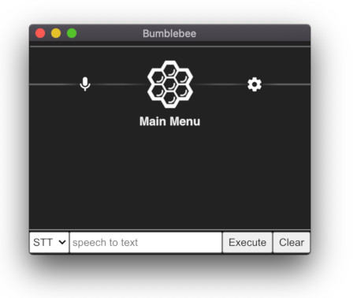

## Developer Installation

#### 1. Install NodeJS and Yarn

Although Bumblebee Electron App its own version of NodeJS, to write new voice apps requires that NodeJS be installed on your system.

- Install [NodeJS](https://nodejs.org/en/), v13 or higher.

- Install [Yarn](https://classic.yarnpkg.com/en/docs/install) package manager, v1.12.3 or higher.

#### 2. Clone this repository

Clone the bumblebee repo and follow these instructions:

```
git clone https://github.com/jaxcore/bumblebee-electron-app
cd bumblebee/bumblebee-electron-app
yarn install
yarn run rebuild
```

#### 3. (Optional) DeepSpeech Model

If you already have
[DeepSpeech 0.7.4](https://github.com/mozilla/DeepSpeech/releases/tag/v0.7.4) installed,
you can copy or softlink
[deepspeech-0.7.4-models.pbmm](https://github.com/mozilla/DeepSpeech/releases/download/v0.7.4/deepspeech-0.7.4-models.pbmm)
and
[deepspeech-0.7.4-models.scorer](https://github.com/mozilla/DeepSpeech/releases/download/v0.7.4/deepspeech-0.7.4-models.scorer)
to the root of the `bumblebee-electron-app` directory to skip the DeepSpeech install procedure.
This can also be used to change or test different DeepSpeech models.

#### 4. Start the bumblebee app

```
yarn run dev
```

The console like this should load it up.



  Make sure to turn your speakers and microphone on and follow the
instructions to install DeepSpeech.  After installation it will confirm
that speech-to-text processing is working.

The app will start at the bare system main menu with no assistants loaded by default.

#### 4. Start an assistant

If you are developing an assistant you can run it now.

If you would like to run the development version of the Bumblebee Assistant, it runs in a separate process
and can be started and stopped at any time:

```
yarn run bumblebee-assistant
```

Alternatively, you can run both the app and the assistant at the same time using:

```
yarn run bumblebee-dev
```

This is similar to how the application runs in a production build.

#### 5. (Optional) Production Build

The `dist` command will produce a packaged version of Bumblebee in the `/dist` directory.

```
yarn run dist
```
