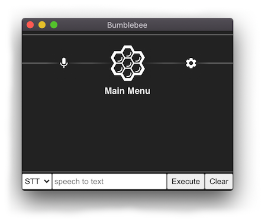

## Developer Installation

#### 1. Install NodeJS and dependencies

Although Bumblebee Electron App supplies its own version of NodeJS, to write new voice apps requires that NodeJS be installed on your system.

- Install [NodeJS](https://nodejs.org/en/), v12 or higher

- for Ubuntu Linux there are additional dependencies:

```
sudo apt install build-essentials libasound2-dev git gcc-multilib libstdc++6
```

- for Windows:
    - install [Git Bash](https://gitforwindows.org/) for a terminal prompt
    - make sure `node` and `npm` are in your $PATH
    - add A BROWSER environment variable using `export BROWSER=NONE`
    - use the `-win` versions of the npm commands

#### 2. Clone this repository

Clone the bumblebee repo and follow these instructions:

```
git clone https://github.com/jaxcore/bumblebee
npm install
```

#### 3. (Optional) Switch to the development branch

To use the latest development version, use the `dev` branch:

```
git checkout dev
```

Use `npm link` to link the local version of the `jaxcore-bumblebee` package to the `electron-app` directory:

```
npm link
cd electron-app
rm -rf node_modules/jaxcore-bumblebee
npm link jaxcore-bumblebee
```

#### 4. Install `electron-app`

```
cd electron-app
npm install
npm run rebuild
```

#### 5. (Optional) DeepSpeech Model

The first time Bumblebee is run, it will prompt to download the DeepSpeech english language models.

If you already have
[DeepSpeech 0.8.0](https://github.com/mozilla/DeepSpeech/releases/tag/v0.8.0) installed,
you can skip the download step by copying or softlinking
[deepspeech-0.8.0-models.pbmm](https://github.com/mozilla/DeepSpeech/releases/download/v0.8.0/deepspeech-0.8.0-models.pbmm)
and
[deepspeech-0.8.0-models.scorer](https://github.com/mozilla/DeepSpeech/releases/download/v0.8.0/deepspeech-0.8.0-models.scorer)
to the root of the `electron-app` directory.
This can also be used to change or test different DeepSpeech models, including different languages.

```
ln -s ../path/to/deepspeech-0.8.0-models.pbmm
ln -s ../path/to/deepspeech-0.8.0-models.scorer
```

#### 6. Start the bumblebee application + assistant

```
npm run bumblebee
```

Windows users use `npm run bumblebee-win` instead.

The console like this should load it up.


#### 7. (Optional) Run without an assistant

The Bumblebee system is being developed with the intention that at least one assistant is running (the "bumblebee assistant" is the default), and all other voice apps can be launched by that assistant's "hotword commands" (skills).  Multiple assistants can be run in parallel and the bumblebee assistant itself can be started and stopped independently of the electron application console.

The bumblebee application can be started without an assistant, instead of `npm run bumblebee` use:

```
npm run dev
```

Windows users use `npm run dev-win` instead.

The console without an assistant looks like this;



If you are developing an assistant you can run it now from a separate terminal window.  See the `examples/assistants` directory for examples of how to set up an assistant.

If you would like to run the development version of the Bumblebee Assistant,
it can be started and stopped from a separate terminal window:

```
npm run bumblebee-assistant
```

#### 8. (Optional) Production Build

The `dist` command will produce a packaged version of Bumblebee in the `/dist` directory.

```
npm run dist
```

Windows users use `npm run dist-win` instead.

#### 9. Uninstall

The auto-downloaded DeepSpeech models are saved to the following directory:

- MacOSX: `~/Library/Application\ Support/com.jaxcore.bumblebee`
- Linux:  `~/.config/com.jaxcore.bumblebee`
- Windows: `~/AppData/Roaming/com.jaxcore.bumblebee`

They are very large and are not automatically deleted when removing Bumblebee from the system, even uninstalling the packaged release.  So they must be manually deleted.