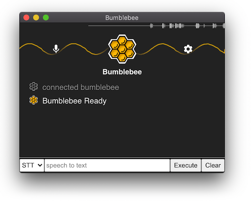

## Bumblebee Electron App

This is the source code repository for the [Bumblebee](https://github.com/jaxcore/bumblebee) desktop interface.

For more information about the Bumblebee voice application framework, be sure to visit:

- [https://github.com/jaxcore/bumblebee](https://github.com/jaxcore/bumblebee)

### Latest Release

It is recommended to install the packaged release version.

- [See latest release](https://github.com/jaxcore/bumblebee-electron-app/releases)

### Developer Installation

If you would like to install Bumblebee from the source files, see [INSTALL](INSTALL.md).